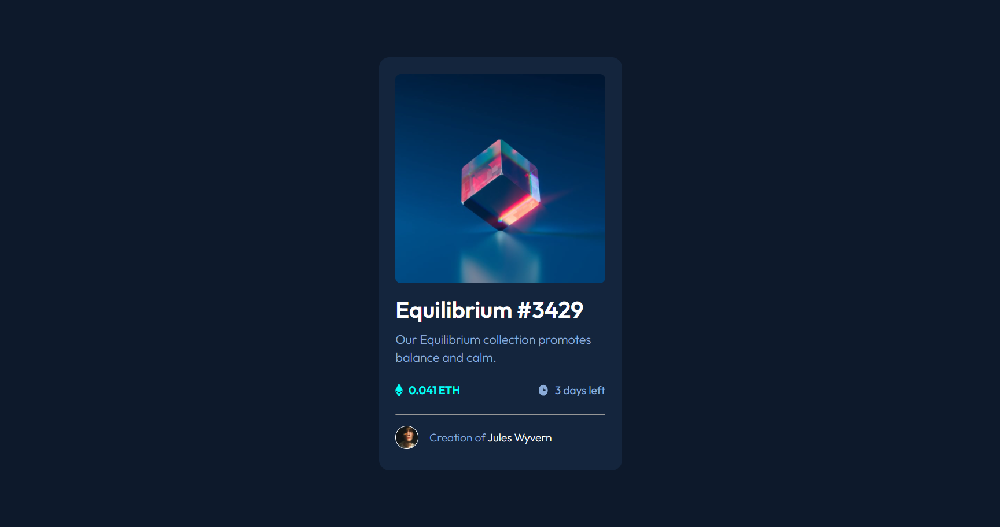
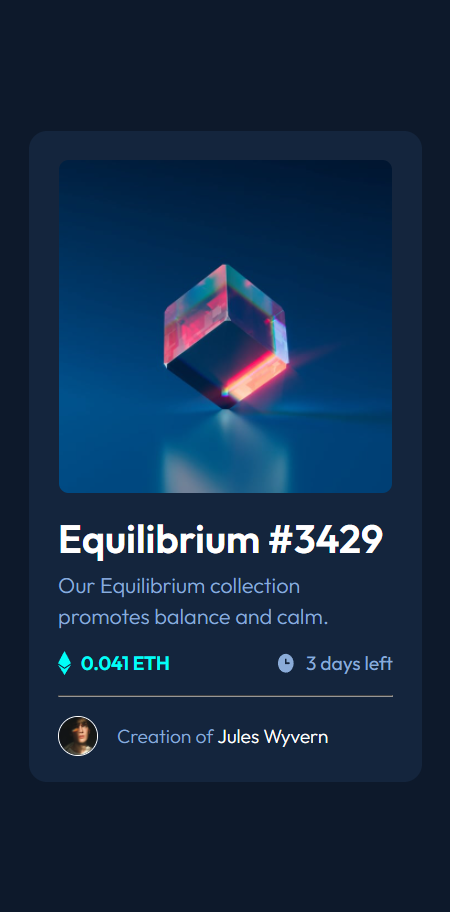

# Frontend Mentor - NFT preview card component solution

This is a solution to the [NFT preview card component challenge on Frontend Mentor](https://www.frontendmentor.io/challenges/nft-preview-card-component-SbdUL_w0U). Frontend Mentor challenges help you improve your coding skills by building realistic projects. 

## Table of contents

- [Frontend Mentor - NFT preview card component solution](#frontend-mentor---nft-preview-card-component-solution)
  - [Table of contents](#table-of-contents)
  - [Overview](#overview)
    - [The challenge](#the-challenge)
    - [Screenshot](#screenshot)
    - [Links](#links)
  - [My process](#my-process)
    - [Built with](#built-with)
    - [What I learned](#what-i-learned)

**Note: Delete this note and update the table of contents based on what sections you keep.**

## Overview

### The challenge

Users should be able to:

- View the optimal layout depending on their device's screen size
- See hover states for interactive elements

### Screenshot

### Links

- [Frontend Mentor Solution Page](https://www.frontendmentor.io/solutions/nft-preview-card-component-usingg-html-and-css-6s1xrupxO)
- [Github Pages Live Demo](https://jorgemunozcerda.github.io/fm-newbie-nft-preview-card-component/)

## My process

### Built with

- HTML5
- CSS
- Flexbox

### What I learned

How to make a transparent overlay over an element. How to enable that on hover. How to make an element appear on hover.